# Image alignment
Attempts to automatically align sequential histochemically stained skeletal muscle sections from [Elson et al. (2002)](https://sci-hub.mksa.top/10.1016/s0960-8966(02)00047-0) images using [openCV](https://opencv.org/).

## Samples Description 

A cropped section from P2 S007.jpg with size of 8 times smaller, higher contrast and a grey background.

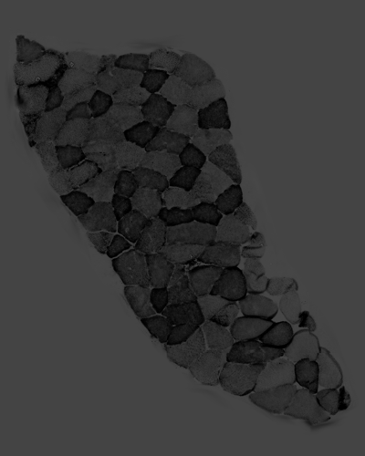

A cropped section from P2 S008.jpg with size of 8 times smaller, higher contrast and a grey background.

### Method 1
[align_orb.py](align_orb.py) was run to align the two samples. Features of the images were detected by [ORB](https://docs.opencv.org/master/d1/d89/tutorial_py_orb.html) detector. Features were matched by [cv2.DESCRIPTOR_MATCHER_BRUTEFORCE_HAMMING](https://docs.opencv.org/3.4/db/d39/classcv_1_1DescriptorMatcher.html) and top 15% matches were selected for warping.

#### Features & matches
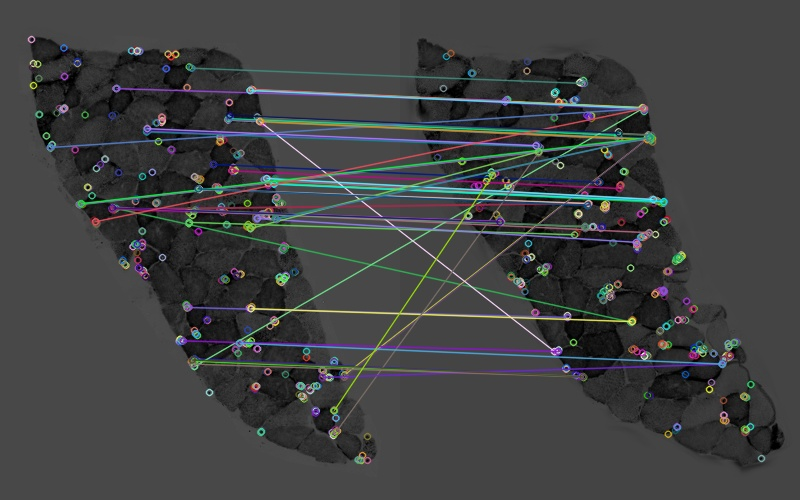
#### Alignment
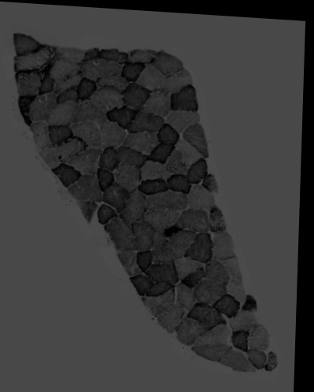

### Method 2
[align_sift.py](align_sift.py) was run to align the two samples. Features of the images were detected by [SIFT](https://docs.opencv.org/master/da/df5/tutorial_py_sift_intro.html) detector and matched by [cv2.BFMatcher.knnMatch](https://docs.opencv.org/master/d3/da1/classcv_1_1BFMatcher.html). Matches with distance smaller than *0.75* were used for warping.
#### Features & matches
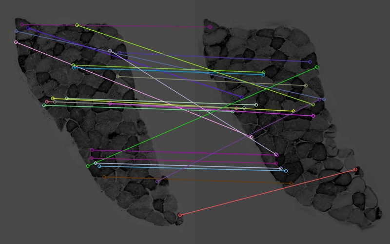
#### Alignment
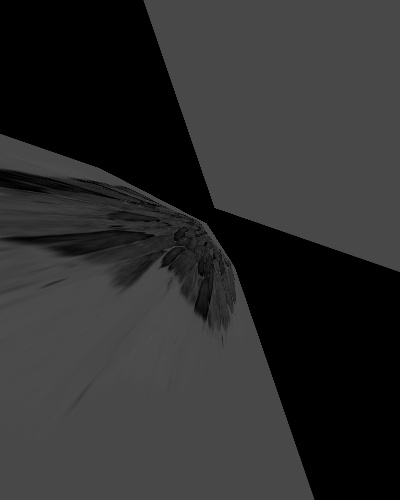

### Method 3
[align_sift.py](align_sift.py) was run to align the two samples. Features of the images were detected by [SIFT](https://docs.opencv.org/master/da/df5/tutorial_py_sift_intro.html) detector and matched by [cv2.BFMatcher.knnMatch](https://docs.opencv.org/master/d3/da1/classcv_1_1BFMatcher.html). Matches with distance smaller than *0.65* were used for warping.
#### Features & matches
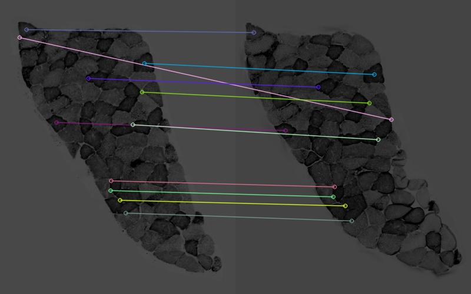
#### Alignment
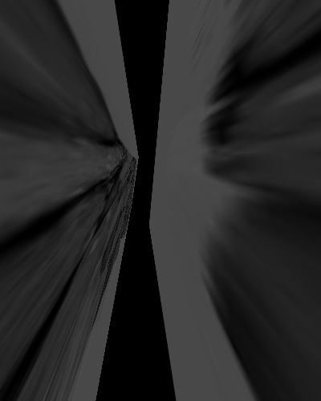

### Method 4
[align_sift.py](align_sift.py) was run to align the two samples. Features of the images were detected by [SIFT](https://docs.opencv.org/master/da/df5/tutorial_py_sift_intro.html) detector and matched by [cv2.BFMatcher.knnMatch](https://docs.opencv.org/master/d3/da1/classcv_1_1BFMatcher.html). Matches with distance smaller than *0.6* were used for warping.
#### Features & matches
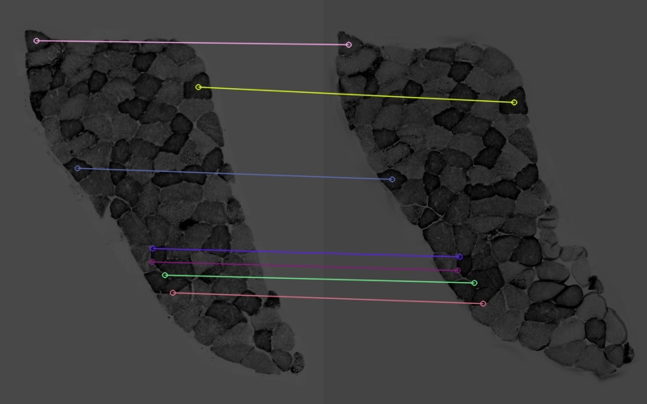
#### Alignment
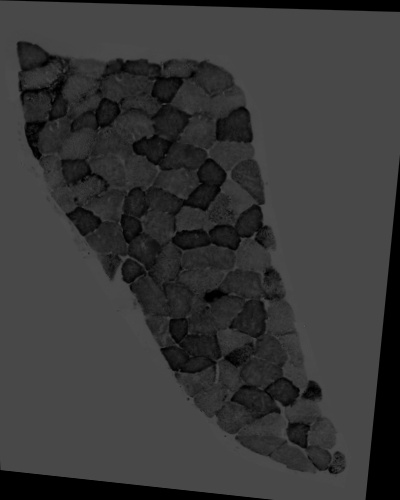

### Method 5
[align_sift.py](align_sift.py) was run to align the two samples. Features of the images were detected by [SIFT](https://docs.opencv.org/master/da/df5/tutorial_py_sift_intro.html) detector and matched by [cv2.BFMatcher.knnMatch](https://docs.opencv.org/master/d3/da1/classcv_1_1BFMatcher.html). Matches with distance smaller than *0.55* were used for warping.
#### Features & matches
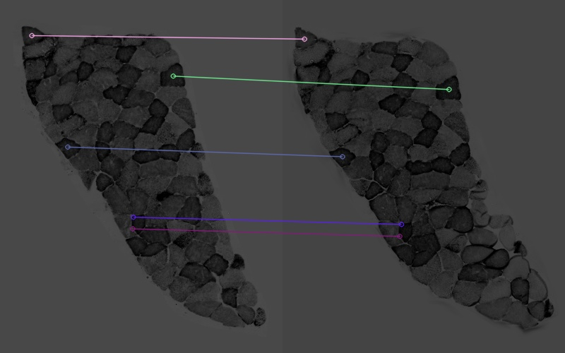
#### Alignment
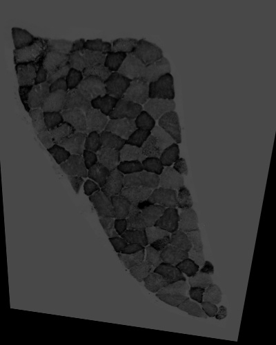
