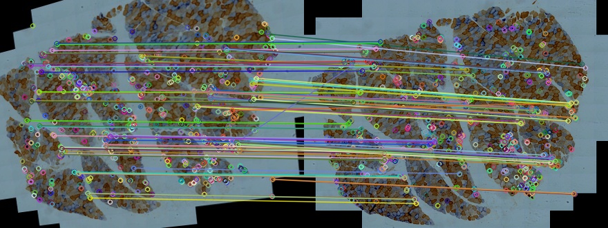
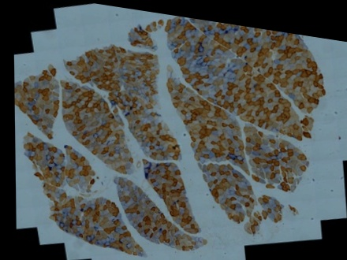
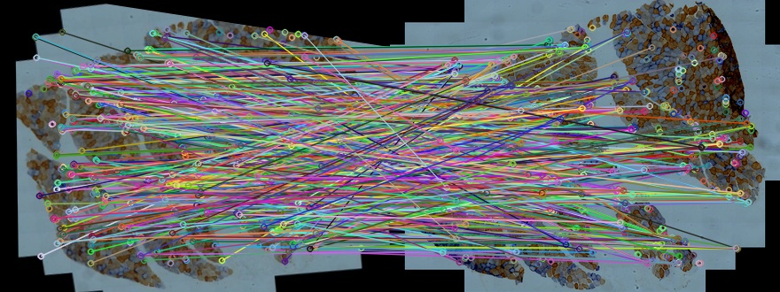
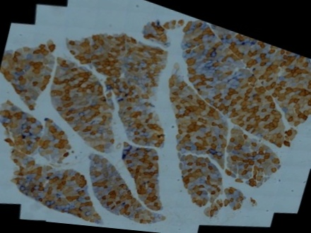

## Data
P2 S001.jpg

P2 S002.jpg

P2 S003.jpg

P2 S004.jpg

## Method
This attempt aligned full images by ORB method, started with the alignment of P2 S001 as reference and P2 S002 as target, followed by each of the following full images as target to the last aligned image.

In each run, images were pre-processed of resizing and contrast and brightness improvement. Their sizes were 30 times smaller. Contrast and brightness of the images were increased with 1.5 times.
In each run, 500 and 1000 of max features were made, and good match percent of 10% to 100% were selected to be be warped respectively.
Euclidean distance and correlation coefficient were applied to test the quality of every single alignment.  In each run, the aligned image with the lowest euclidean distance and highest correlation coefficient would be the best aligned image. which would be selected as the reference image in next run.

## Result
There were 20 aligned images in each run. Only the best image would be shown in the result.

### Run time 1
Reference image : P2 S001.jpg
Target image: P2 S002.jpg
#### Features & Matches
.jpg)

|  Matching Data  |   |
| -----------------------------------  | --- |
| Max Features                         | 1000 |
|          Good Match Percent          | 0.2  |
|     Number of good matches found     | 194  |
#### Alignment
Aligned1
.jpg)
#### Quality test

The image has both the lowest distance and the highest coefficient to the target image.
Euclidean distance and correlation coefficient between aligned result and source images were calculated as follows:

|     Source      | Euclidean Distance | Correlation Coefficient |
| ------------ | --- | --- |
| Reference Image | 33405.260918  |   0.150503   |
|  Target Image   | 28900.615962  |   0.349871    |

### Run time 4
Reference image : Aligned1
Target image: P2 S003.jpg
#### Features & Matches

|  Matching Data  |   |
| -----------------------------------  | --- |
| Max Features                         | 1000 |
|          Good Match Percent          | 0.1 |
|     Number of good matches found     | 97  |
#### Alignment
Aligned2

#### Quality test

The image has both the lowest distance and the highest coefficient to the target image.
Euclidean distance and correlation coefficient between aligned result and source images were calculated as follows:

|     Source      | Euclidean Distance | Correlation Coefficient |
| ------------ | --- | --- |
| Reference Image | 31026.456340  |   0.150954   |
|  Target Image   | 22406.784687  |   0.573588    |

### Run time 4
Reference image : Aligned2
Target image: P2 S004.jpg
#### Features & Matches

|  Matching Data  |   |
| -----------------------------------  | --- |
| Max Features                         | 1000 |
|          Good Match Percent          | 0.6 |
|     Number of good matches found     | 580  |
#### Alignment
Aligned1

#### Quality test

The image has the highest coefficient to the target image.
Euclidean distance and correlation coefficient between aligned result and source images were calculated as follows:

|     Source      | Euclidean Distance | Correlation Coefficient |
| ------------ | --- | --- |
| Reference Image | 32579.392705  |  0.162886     |  
|  Target Image   | 30582.117880  |   0.300948    |

