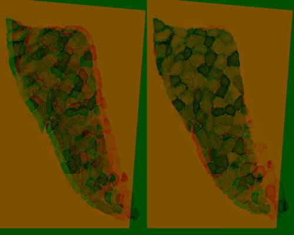
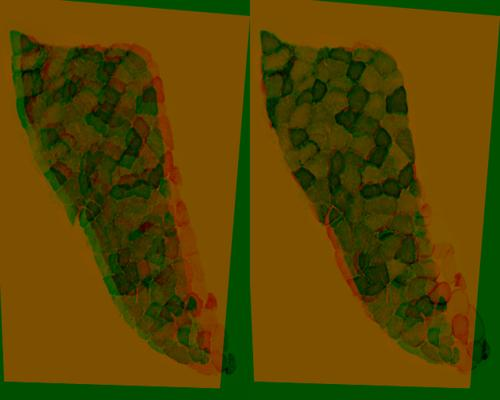

## Samples Description 
#### Reference image

A cropped section from P2 S007.jpg. The image is brightened version of the reference image from [greybackground](./greybackground.md)   

#### Target image

A cropped section from P2 S008.jpg. The image is brightened version of the target image from [greybackground](./greybackground.md)

### Method 1
[align_sift.py](../align_sift.py) was run to align the two samples. Features of the images were detected by [SIFT](https://docs.opencv.org/master/da/df5/tutorial_py_sift_intro.html) detector and matched by [cv2.BFMatcher.knnMatch](https://docs.opencv.org/master/d3/da1/classcv_1_1BFMatcher.html). Matches with distance smaller than *0.75* were used for warping.
#### Features & matches

|  Matching Data  |   |
| -----------------------------------  | --- |
| Total features detected in Ref Image |  935  |
| Total features detected in Tar Image |  830  |
|          Euclidean Distance          | <0.75 |
|     Number of good matches found     |  48   |
#### Alignment

#### Quality test

### Method 2
[align_sift.py](../align_sift.py) was run to align the two samples. Features of the images were detected by [SIFT](https://docs.opencv.org/master/da/df5/tutorial_py_sift_intro.html) detector and matched by [cv2.BFMatcher.knnMatch](https://docs.opencv.org/master/d3/da1/classcv_1_1BFMatcher.html). Matches with distance smaller than *0.60* were used for warping.
#### Features & matches

|  Matching Data  |   |
| -----------------------------------  | --- |
| Total features detected in Ref Image | 935  |
| Total features detected in Tar Image | 830  |
|          Euclidean Distance          | <0.6 |
|     Number of good matches found     |  19  |
#### Alignment

#### Quality test

### Method 3
[align_sift.py](../align_sift.py) was run to align the two samples. Features of the images were detected by [SIFT](https://docs.opencv.org/master/da/df5/tutorial_py_sift_intro.html) detector and matched by [cv2.BFMatcher.knnMatch](https://docs.opencv.org/master/d3/da1/classcv_1_1BFMatcher.html). Matches with distance smaller than *0.55* were used for warping.
#### Features & matches

|  Matching Data  |   |
| -----------------------------------  | --- |
| Total features detected in Ref Image |  935  |
| Total features detected in Tar Image |  830  |
|          Euclidean Distance          | <0.55 |
|     Number of good matches found     |  14   |
#### Alignment

#### Quality test
