## Samples Description 
#### Reference image
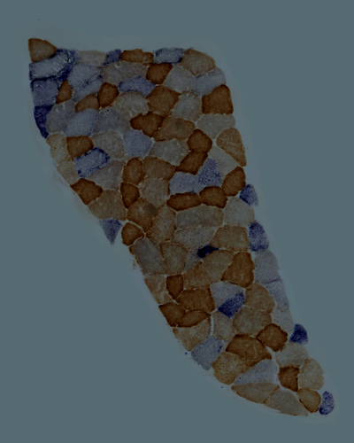

A cropped section from P2 S007.jpg. The image was brightened, contrast-increased and resized to 400 X 500.

#### Target image
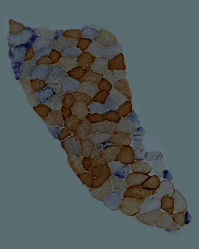

A cropped section from P2 S008.jpg. The image was brightened, contrast-increased and resized to 400 X 500.

## Methods
In method 1 to 4, images were detected by [SIFT](https://docs.opencv.org/master/da/df5/tutorial_py_sift_intro.html) detector. Matches were sorted by different euclidean distance for warping. In method 5 to 9, images were detected by [ORB](https://docs.opencv.org/master/d1/d89/tutorial_py_orb.html) detector. Different percentage of good matches were selected for warping. 
### Method 1
[align_sift.py](../align_sift.py) was run to align the two samples. Features of the images were detected by SIFT detector and matched by [cv2.BFMatcher.knnMatch](https://docs.opencv.org/master/d3/da1/classcv_1_1BFMatcher.html). Matches with distance smaller than *0.75* were used for warping.
#### Features & Matches
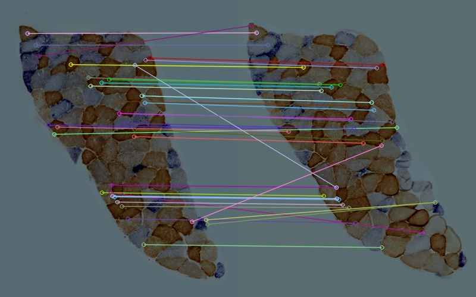

|  Matching Data  |   |
| -----------------------------------  | --- |
| Total features detected in Ref Image |  527  |
| Total features detected in Tar Image |  460  |
|          Euclidean Distance          | <0.75 |
|     Number of good matches found     |  35   |
#### Alignment
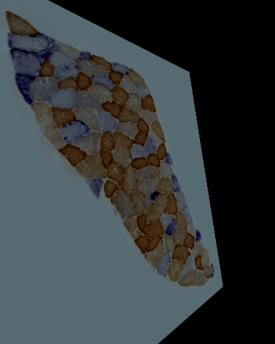
#### Quality test
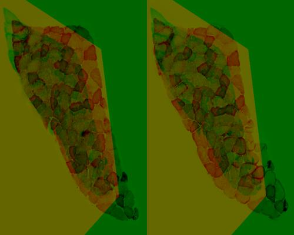

Euclidean distance and correlation coefficient between aligned result and source images were calculated as follows:

|     Source      | Euclidean Distance | Correlation Coefficient |
| ------------ | --- | --- |
| Reference Image | 17593.88780230225  |   0.5466140246003929    |
|  Target Image   | 17458.29602223539  |   0.5213824814205756    |

### Method 2
[align_sift.py](../align_sift.py) was run to align the two samples. Features of the images were detected by SIFT detector and matched by cv2.BFMatcher.knnMatch. 
Matches with distance smaller than *0.65* were used for warping.
#### Features & Matches

|  Matching Data  |   |
| -----------------------------------  | --- |
| Total features detected in Ref Image |  527  |
| Total features detected in Tar Image |  460  |
|          Euclidean Distance          | <0.65 |
|     Number of good matches found     |  19   |
#### Alignment
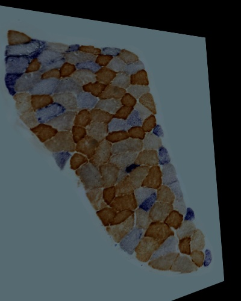
#### Quality test
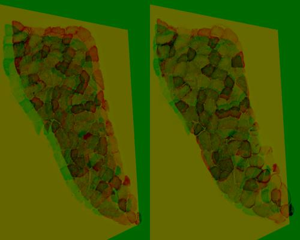

Euclidean distance and correlation coefficient between aligned result and source images were calculated as follows:

|     Source      | Euclidean Distance | Correlation Coefficient |
| ------------ | --- | --- |
| Reference Image | 18971.135970204843 |   0.5499468306353424    |
|  Target Image   | 16048.54077478697  |   0.6740048656731992    |

### Method 3
[align_sift.py](../align_sift.py) was run to align the two samples. Features of the images were detected by SIFT detector and matched by cv2.BFMatcher.knnMatch. 
Matches with distance smaller than *0.6* were used for warping.
#### Features & Matches
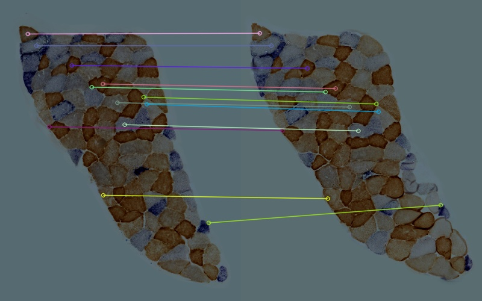

|  Matching Data  |   |
| -----------------------------------  | --- |
| Total features detected in Ref Image |  527  |
| Total features detected in Tar Image |  460  |
|          Euclidean Distance          | <0.6 |
|     Number of good matches found     |  12   |
#### Alignment
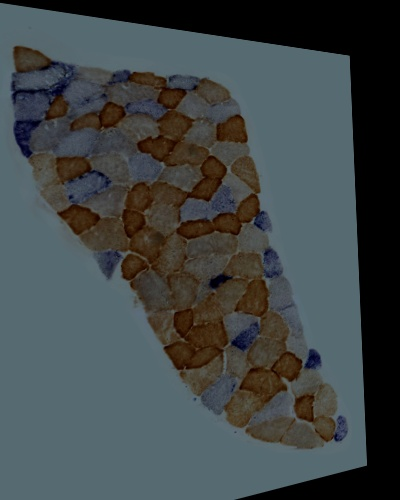
#### Quality test
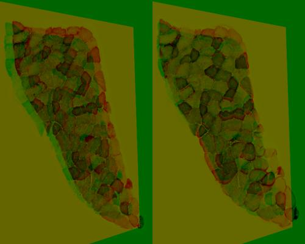

Euclidean distance and correlation coefficient between aligned result and source images were calculated as follows:

|     Source      | Euclidean Distance | Correlation Coefficient |
| ------------ | --- | --- |
| Reference Image | 18256.58505854805  |   0.5841249182827489    |
|  Target Image   | 15516.39706890746  |    0.693315343610086    |

### Method 4
[align_sift.py](../align_sift.py) was run to align the two samples. Features of the images were detected by SIFT detector and matched by cv2.BFMatcher.knnMatch. 
Matches with distance smaller than *0.55* were used for warping.
#### Features & Matches
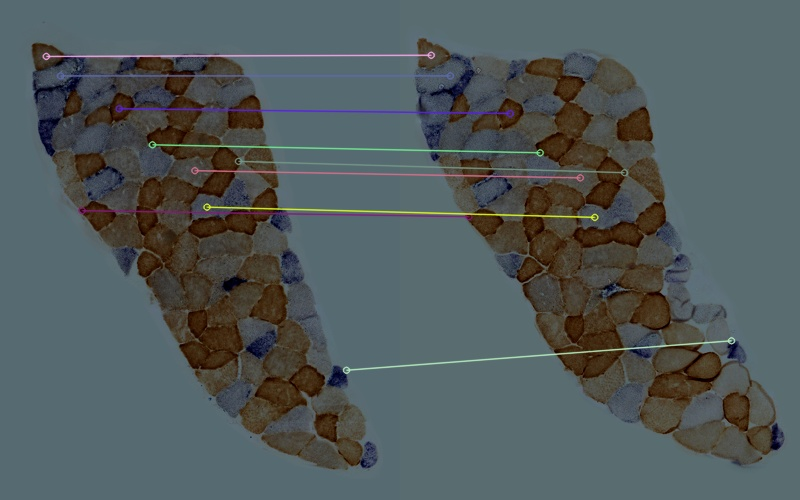

|  Matching Data  |   |
| -----------------------------------  | --- |
| Total features detected in Ref Image |  527  |
| Total features detected in Tar Image |  460  |
|          Euclidean Distance          | <0.55 |
|     Number of good matches found     |   9   |
#### Alignment
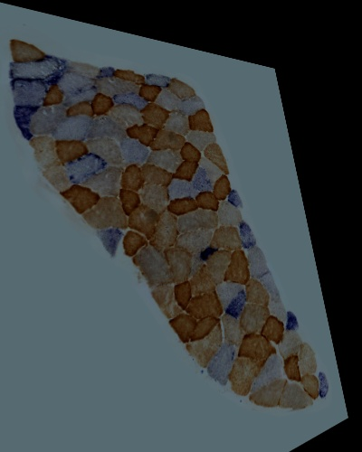
#### Quality test
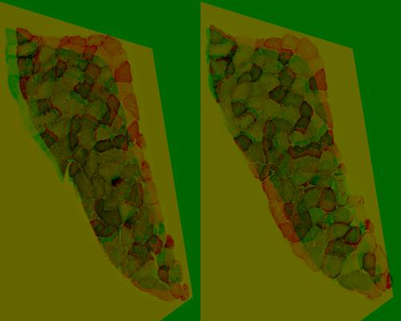

Euclidean distance and correlation coefficient between aligned result and source images were calculated as follows:

|     Source      | Euclidean Distance | Correlation Coefficient |
| ------------ | --- | --- |
| Reference Image | 17244.673380496366 |   0.6120464918603491    |
|  Target Image   | 16650.304802014885 |   0.6246424732216946    |

### Method 5
[align_orb.py](../align_orb.py) was run to align the two samples. Features of the images were detected by ORB detector. 
Features were matched by [cv2.DESCRIPTOR_MATCHER_BRUTEFORCE_HAMMING](https://docs.opencv.org/3.4/db/d39/classcv_1_1DescriptorMatcher.html) and top 10% matches were selected for warping.
#### Features & Matches
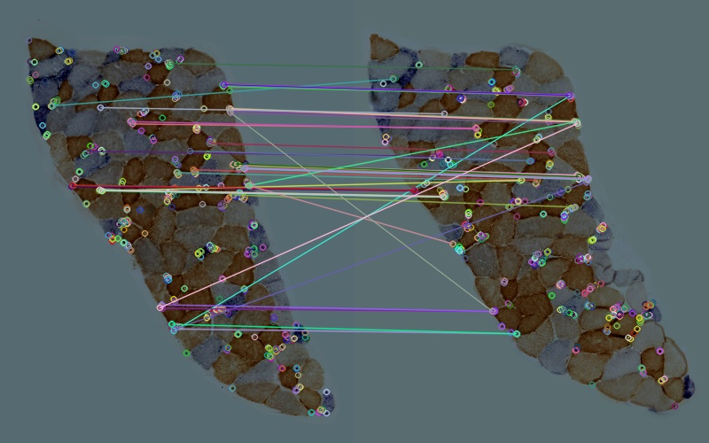

|  Matching Data  |   |
| -----------------------------------  | --- |
| Total features detected in Ref Image | 500 |
| Total features detected in Tar Image | 500 |
|          Good Match Percent          | 0.1 |
|     Number of good matches found     | 50  |
#### Alignment
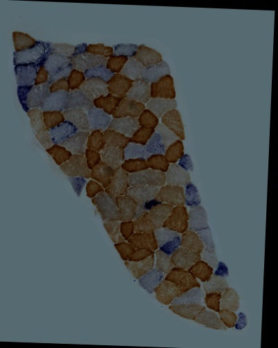
#### Quality test
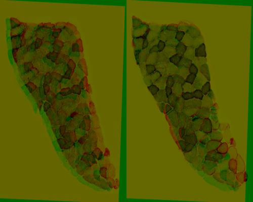

Euclidean distance and correlation coefficient between aligned result and source images were calculated as follows:

|     Source      | Euclidean Distance | Correlation Coefficient |
| ------------ | --- | --- |
| Reference Image | 17730.534566109392 |    0.637970387366932    |
|  Target Image   | 14592.126164476513 |   0.7538061710009192    |

### Method 6
[align_orb.py](../align_orb.py) was run to align the two samples. Features of the images were detected by ORB detector. 
Features were matched by cv2.DESCRIPTOR_MATCHER_BRUTEFORCE_HAMMING and top 20% matches were selected for warping.
#### Features & Matches
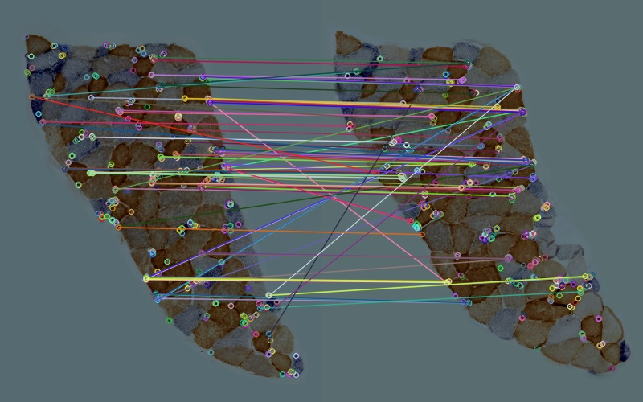

|  Matching Data  |   |
| -----------------------------------  | --- |
| Total features detected in Ref Image | 500 |
| Total features detected in Tar Image | 500 |
|          Good Match Percent          | 0.2 |
|     Number of good matches found     | 100 |
#### Alignment
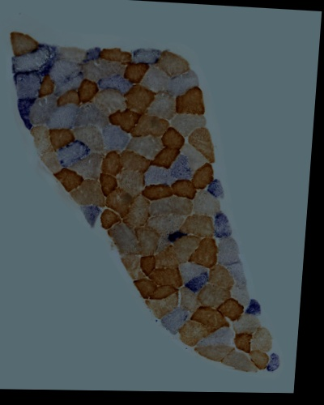
#### Quality test
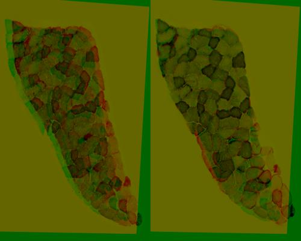

Euclidean distance and correlation coefficient between aligned result and source images were calculated as follows:

|     Source      | Euclidean Distance | Correlation Coefficient |
| ------------ | --- | --- |
| Reference Image | 18192.849007233584 |   0.6164652298617866    |
|  Target Image   | 14884.285673152071 |   0.7425811790841993    |

### Method 7
[align_orb.py](../align_orb.py) was run to align the two samples. Features of the images were detected by ORB detector. 
Features were matched by cv2.DESCRIPTOR_MATCHER_BRUTEFORCE_HAMMING and top 30% matches were selected for warping.
#### Features & Matches
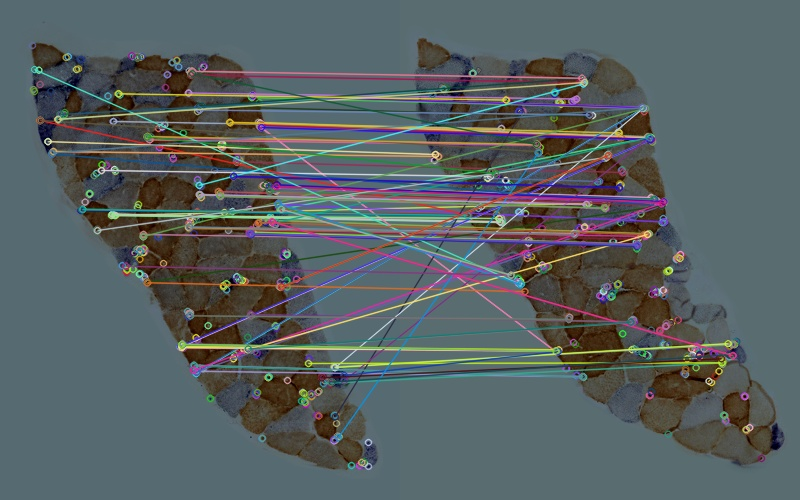

|  Matching Data  |   |
| -----------------------------------  | --- |
| Total features detected in Ref Image | 500 |
| Total features detected in Tar Image | 500 |
|          Good Match Percent          | 0.3 |
|     Number of good matches found     | 150 |
#### Alignment
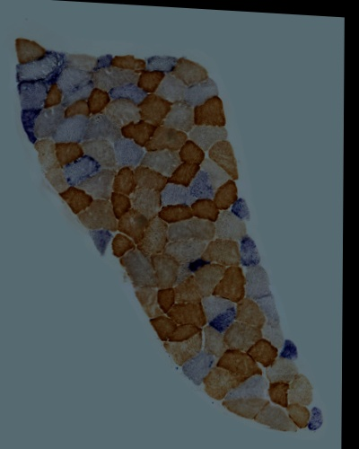
#### Quality test
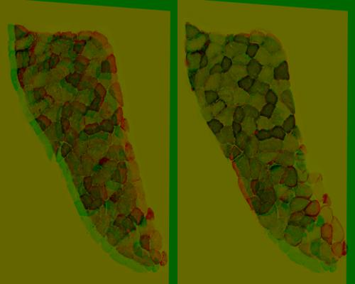

Euclidean distance and correlation coefficient between aligned result and source images were calculated as follows:

|     Source      | Euclidean Distance | Correlation Coefficient |
| ------------ | --- | --- |
| Reference Image | 16767.677805826304 |   0.6664706661103533    |
|  Target Image   | 13481.85083732942  |    0.782922249061711    |

### Method 8
[align_orb.py](../align_orb.py) was run to align the two samples. Features of the images were detected by ORB detector. 
Features were matched by cv2.DESCRIPTOR_MATCHER_BRUTEFORCE_HAMMING and top 35% matches were selected for warping.
#### Features & Matches
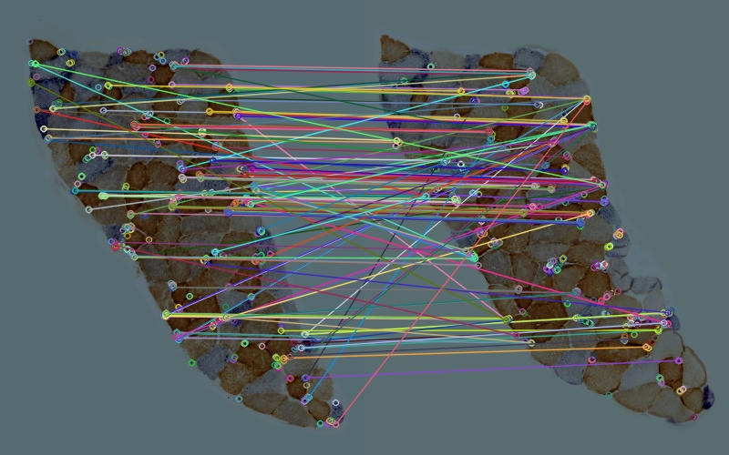

|  Matching Data  |   |
| -----------------------------------  | --- |
| Total features detected in Ref Image | 500 |
| Total features detected in Tar Image | 500 |
|          Good Match Percent          | 0.35 |
|     Number of good matches found     | 175 |
#### Alignment

#### Quality test
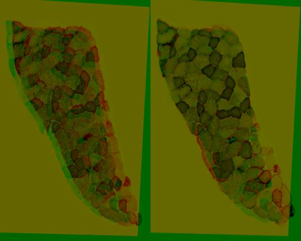

Euclidean distance and correlation coefficient between aligned result and source images were calculated as follows:

|     Source      | Euclidean Distance | Correlation Coefficient |
| ------------ | --- | --- |
| Reference Image | 18041.934818638492 |   0.6235697615625276    |
|  Target Image   | 14584.686181059913 |   0.7535235211694709    |

### Method 9
[align_orb.py](../align_orb.py) was run to align the two samples. Features of the images were detected by ORB detector. 
Features were matched by cv2.DESCRIPTOR_MATCHER_BRUTEFORCE_HAMMING and top 40% matches were selected for warping.
#### Features & Matches
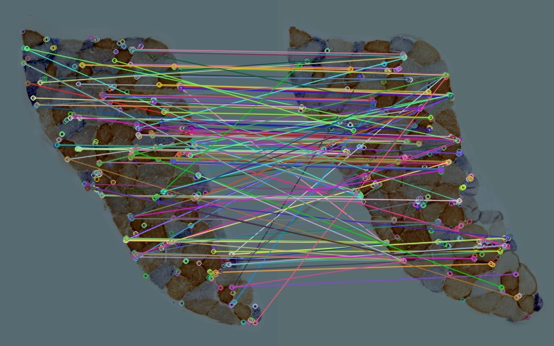

|  Matching Data  |   |
| -----------------------------------  | --- |
| Total features detected in Ref Image | 500 |
| Total features detected in Tar Image | 500 |
|          Good Match Percent          | 0.4 |
|     Number of good matches found     | 200 |
#### Alignment
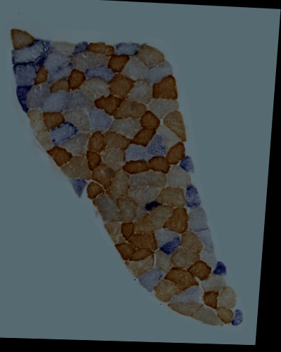
#### Quality test
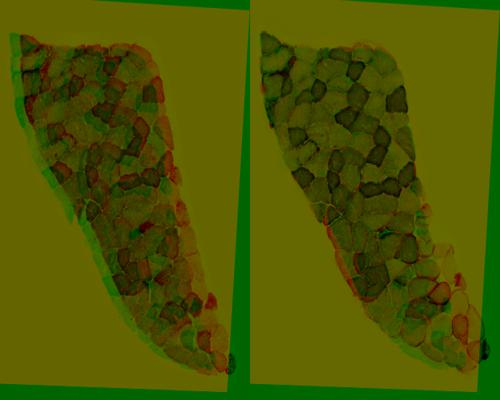

Euclidean distance and correlation coefficient between aligned result and source images were calculated as follows:

|     Source      | Euclidean Distance | Correlation Coefficient |
| ------------ | --- | --- |
| Reference Image | 18042.819375031166 |   0.6223797160017572    |
|  Target Image   | 14565.674924286894 |   0.7530770666338003    |

## Conclusion
In conclusion, alignments launched by ORB method performed better than those by SIFT method. 
For the quality testing metrics, result with 30% good matches has a smaller Euclidean distance and a higher correlation coefficient than other ORB alignments.
