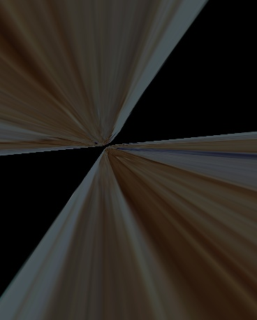
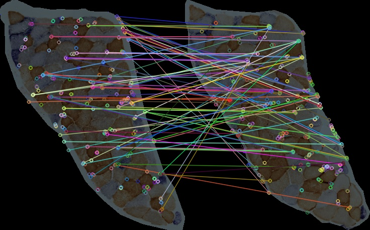

## Samples Description 
#### Reference image

A cropped section from P2 S007.jpg without background. The image was resized to 368 X 457.

#### Target image

A cropped section from P2 S008.jpg without background. The image was resized to 368 X 457.

## Methods
In method 1 to 3, images were detected by [SIFT](https://docs.opencv.org/master/da/df5/tutorial_py_sift_intro.html) detector. Matches were sorted by different euclidean distance for warping. In method 4 to 8, images were detected by [ORB](https://docs.opencv.org/master/d1/d89/tutorial_py_orb.html) detector. Different percentage of good matches were selected for warping. 
### Method 1
[align_sift.py](../align_sift.py) was run to align the two samples. Features of the images were detected by SIFT detector and matched by [cv2.BFMatcher.knnMatch](https://docs.opencv.org/master/d3/da1/classcv_1_1BFMatcher.html). 
Matches with distance smaller than *0.75* were used for warping.
#### Features & Matches

|  Matching Data  |   |
| -----------------------------------  | --- |
| Total features detected in Ref Image | 199  |
| Total features detected in Tar Image | 226  |
|          Euclidean Distance          | <0.75 |
|     Number of good matches found     |  9  |
#### Alignment

### Method 2
[align_sift.py](../align_sift.py) was run to align the two samples. Features of the images were detected by SIFT detector and matched by cv2.BFMatcher.knnMatch. 
Matches with distance smaller than *0.85* were used for warping.
#### Features & Matches

|  Matching Data  |   |
| -----------------------------------  | --- |
| Total features detected in Ref Image | 199  |
| Total features detected in Tar Image | 226  |
|          Euclidean Distance          | <0.85 |
|     Number of good matches found     |  28   |
#### Alignment

#### Quality test

### Method 3
[align_sift.py](../align_sift.py) was run to align the two samples. Features of the images were detected by SIFT detector and matched by cv2.BFMatcher.knnMatch. 
Matches with distance smaller than *0.9* were used for warping.
#### Features & Matches

|  Matching Data  |   |
| -----------------------------------  | --- |
| Total features detected in Ref Image | 199  |
| Total features detected in Tar Image | 226  |
|          Euclidean Distance          | <0.9 |
|     Number of good matches found     |  49  |
#### Alignment

#### Quality test

### Method 4
[align_orb.py](../align_orb.py) was run to align the two samples. Features of the images were detected by ORB detector. 
Features were matched by [cv2.DESCRIPTOR_MATCHER_BRUTEFORCE_HAMMING](https://docs.opencv.org/3.4/db/d39/classcv_1_1DescriptorMatcher.html) and top 10% matches were selected for warping.
#### Features & Matches

|  Matching Data  |   |
| -----------------------------------  | --- |
| Total features detected in Ref Image | 378 |
| Total features detected in Tar Image | 383 |
|          Good Match Percent          | 0.1 |
|     Number of good matches found     | 37  |
#### Alignment

### Method 5
[align_orb.py](../align_orb.py) was run to align the two samples. Features of the images were detected by ORB detector. 
Features were matched by cv2.DESCRIPTOR_MATCHER_BRUTEFORCE_HAMMING and top 20% matches were selected for warping.
#### Features & Matches

|  Matching Data  |   |
| -----------------------------------  | --- |
| Total features detected in Ref Image | 378 |
| Total features detected in Tar Image | 383 |
|          Good Match Percent          | 0.2 |
|     Number of good matches found     | 75  |
#### Alignment

#### Quality test

Euclidean distance and correlation coefficient between aligned result and source images were calculated as follows:

|     Source      | Euclidean Distance | Correlation Coefficient |
| ------------ | --- | --- |
| Reference Image | 14379.871174666343 |   0.11442731838925792   |
|  Target Image   | 12163.067622931314 |   0.33361272298703065   |

### Method 6
[align_orb.py](../align_orb.py) was run to align the two samples. Features of the images were detected by ORB detector. 
Features were matched by cv2.DESCRIPTOR_MATCHER_BRUTEFORCE_HAMMING and top 25% matches were selected for warping.
#### Features & Matches

|  Matching Data  |   |
| -----------------------------------  | --- |
| Total features detected in Ref Image | 378 |
| Total features detected in Tar Image | 383 |
|          Good Match Percent          | 0.25 |
|     Number of good matches found     | 94  |
#### Alignment

#### Quality test

Euclidean distance and correlation coefficient between aligned result and source images were calculated as follows:

|     Source      | Euclidean Distance | Correlation Coefficient |
| ------------ | --- | --- |
| Reference Image | 14325.578766667684 |   0.12424537996607808   |
|  Target Image   | 12084.410287639195 |   0.3464205392082563    |

### Method 7
[align_orb.py](../align_orb.py) was run to align the two samples. Features of the images were detected by ORB detector. 
Features were matched by cv2.DESCRIPTOR_MATCHER_BRUTEFORCE_HAMMING and top 30% matches were selected for warping.
#### Features & Matches

|  Matching Data  |   |
| -----------------------------------  | --- |
| Total features detected in Ref Image | 378 |
| Total features detected in Tar Image | 383 |
|          Good Match Percent          | 0.30 |
|     Number of good matches found     | 113  |
#### Alignment

#### Quality test

Euclidean distance and correlation coefficient between aligned result and source images were calculated as follows:

|     Source      | Euclidean Distance | Correlation Coefficient |
| ------------ | --- | --- |
| Reference Image | 14125.902732215029 |   0.12326598985107479   |
|  Target Image   | 11988.566428059696 |   0.34146057245549466   |

### Method 7
[align_orb.py](../align_orb.py) was run to align the two samples. Features of the images were detected by ORB detector. 
Features were matched by cv2.DESCRIPTOR_MATCHER_BRUTEFORCE_HAMMING and top 35% matches were selected for warping.
#### Features & Matches

|  Matching Data  |   |
| -----------------------------------  | --- |
| Total features detected in Ref Image | 378 |
| Total features detected in Tar Image | 383 |
|          Good Match Percent          | 0.30 |
|     Number of good matches found     | 132  |
#### Alignment

#### Quality test

Euclidean distance and correlation coefficient between aligned result and source images were calculated as follows:

|     Source      | Euclidean Distance | Correlation Coefficient |
| ------------ | --- | --- |
| Reference Image | 14326.226195338395 |   0.10095187850071934   |
|  Target Image   | 12179.668673654469 |   0.3207139636388266    |

## Conclusion
In conclusion, alignments launched by ORB method performed better than those by SIFT method. 
For the quality testing metrics, result with 30% good matches has a smaller Euclidean distance than other ORB alignments.