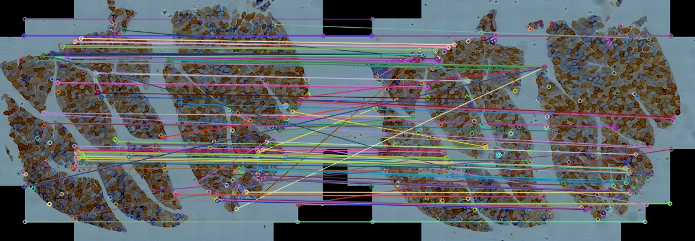
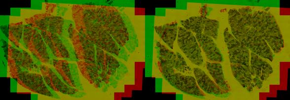

## Samples Description 
#### Reference image
P2 S007.jpg

The image was preprocessed of resizing and contrast and brightness improvement. The size was 30 times smaller. Contrast and brightness of the images were increased with 1.5 times.

#### Target image
P2 S008.jpg

The image was preprocessed of resizing and contrast and brightness improvement. The size was 30 times smaller. Contrast and brightness of the images were increased with 1.5 times.

## Methods
This attempt aligned full images by ORB method. Comparison was made within different good matches percent. In every single method, comparison between max features of 500 and 1000 was made.
### Method 1
[align_orb.py](../align_orb.py) was run to align the two samples. Features of the images were detected by ORB detector. Features were matched by cv2.DESCRIPTOR_MATCHER_BRUTEFORCE_HAMMING and top 10% matches were selected for warping. 
### 1.1 Max Features of 500
#### Features & Matches

|  Matching Data  |   |
| -----------------------------------  | --- |
| Total features detected in Ref Image | 500 |
| Total features detected in Tar Image | 500 |
|          Good Match Percent          | 0.1 |
|     Number of good matches found     | 50  |
#### Alignment

#### Quality test

Euclidean distance and correlation coefficient between aligned result and source images were calculated as follows:

|     Source      | Euclidean Distance | Correlation Coefficient |
| ------------ | --- | --- |
| Reference Image | 45020.69178722157  |   0.09469303908324264   |
|  Target Image   | 32494.458619893947 |   0.5132238605856101    |

### 1.2 Max Features of 1000
#### Features & Matches

|  Matching Data  |   |
| -----------------------------------  | --- |
| Total features detected in Ref Image | 1000 |
| Total features detected in Tar Image | 1000 |
|          Good Match Percent          | 0.1  |
|     Number of good matches found     | 100  |
#### Alignment

#### Quality test

Euclidean distance and correlation coefficient between aligned result and source images were calculated as follows:

|     Source      | Euclidean Distance | Correlation Coefficient |
| ------------ | --- | --- |
| Reference Image | 45101.41126395049  |   0.09201392071461383   |
|  Target Image   | 32332.79737356482  |   0.5184880084212756    |

### Method 2
[align_orb.py](../align_orb.py) was run to align the two samples. Features of the images were detected by ORB detector. Features were matched by cv2.DESCRIPTOR_MATCHER_BRUTEFORCE_HAMMING and top 20% matches were selected for warping. 
### 2.1 Max Features of 500
#### Features & Matches

|  Matching Data  |   |
| -----------------------------------  | --- |
| Total features detected in Ref Image | 500 |
| Total features detected in Tar Image | 500 |
|          Good Match Percent          | 0.2 |
|     Number of good matches found     | 100 |
#### Alignment

#### Quality test

Euclidean distance and correlation coefficient between aligned result and source images were calculated as follows:

|     Source      | Euclidean Distance | Correlation Coefficient |
| ------------ | --- | --- |
| Reference Image | 44804.725107961545 |   0.09729899919926782   |
|  Target Image   | 32687.003732370453 |    0.503813944626444    |

### 2.2 Max Features of 1000
#### Features & Matches

|  Matching Data  |   |
| -----------------------------------  | --- |
| Total features detected in Ref Image | 1000 |
| Total features detected in Tar Image | 1000 |
|          Good Match Percent          | 0.2  |
|     Number of good matches found     | 200  |
#### Alignment

#### Quality test

Euclidean distance and correlation coefficient between aligned result and source images were calculated as follows:

|     Source      | Euclidean Distance | Correlation Coefficient |
| ------------ | --- | --- |
| Reference Image | 45131.87390304107  |   0.09752002327988424   |
|  Target Image   | 32781.33467386586  |   0.5087856128112552    |

### Method 3
[align_orb.py](../align_orb.py) was run to align the two samples. Features of the images were detected by ORB detector. Features were matched by cv2.DESCRIPTOR_MATCHER_BRUTEFORCE_HAMMING and top 30% matches were selected for warping. 
### 3.1 Max Features of 500
#### Features & Matches

|  Matching Data  |   |
| -----------------------------------  | --- |
| Total features detected in Ref Image | 500 |
| Total features detected in Tar Image | 500 |
|          Good Match Percent          | 0.3 |
|     Number of good matches found     | 150 |
#### Alignment

#### Quality test

Euclidean distance and correlation coefficient between aligned result and source images were calculated as follows:

|     Source      | Euclidean Distance | Correlation Coefficient |
| ------------ | --- | --- |
| Reference Image | 45175.26904181092  |   0.09671758131027179   |
|  Target Image   | 32960.328563289535 |   0.5042199565649266    |

### 3.2 Max Features of 1000
#### Features & Matches

|  Matching Data  |   |
| -----------------------------------  | --- |
| Total features detected in Ref Image | 1000 |
| Total features detected in Tar Image | 1000 |
|          Good Match Percent          | 0.3  |
|     Number of good matches found     | 300  |
#### Alignment

#### Quality test

Euclidean distance and correlation coefficient between aligned result and source images were calculated as follows:

|     Source      | Euclidean Distance | Correlation Coefficient |
| ------------ | --- | --- |
| Reference Image | 44765.01017535906  |   0.09881573030127878   |
|  Target Image   | 31791.28193388873  |   0.5304479705195786    |

### Method 4
[align_orb.py](../align_orb.py) was run to align the two samples. Features of the images were detected by ORB detector. Features were matched by cv2.DESCRIPTOR_MATCHER_BRUTEFORCE_HAMMING and top 40% matches were selected for warping. 
### 4.1 Max Features of 500
#### Features & Matches

|  Matching Data  |   |
| -----------------------------------  | --- |
| Total features detected in Ref Image | 500 |
| Total features detected in Tar Image | 500 |
|          Good Match Percent          | 0.4 |
|     Number of good matches found     | 200 |
#### Alignment

#### Quality test

Euclidean distance and correlation coefficient between aligned result and source images were calculated as follows:

|     Source      | Euclidean Distance | Correlation Coefficient |
| ------------ | --- | --- |
| Reference Image | 45198.36263627257  |   0.09028432234862112   |
|  Target Image   | 32732.975025194395 |   0.5077838692487043    |

### 4.2 Max Features of 1000
#### Features & Matches

|  Matching Data  |   |
| -----------------------------------  | --- |
| Total features detected in Ref Image | 1000 |
| Total features detected in Tar Image | 1000 |
|          Good Match Percent          | 0.4  |
|     Number of good matches found     | 400  |
#### Alignment

#### Quality test

Euclidean distance and correlation coefficient between aligned result and source images were calculated as follows:

|     Source      | Euclidean Distance | Correlation Coefficient |
| ------------ | --- | --- |
| Reference Image | 44521.68390795658  |   0.10661672299700097   |
|  Target Image   | 31592.919444077972 |   0.5352738037470022    |

### Method 5
[align_orb.py](../align_orb.py) was run to align the two samples. Features of the images were detected by ORB detector. Features were matched by cv2.DESCRIPTOR_MATCHER_BRUTEFORCE_HAMMING and top 50% matches were selected for warping. 
### 5.1 Max Features of 500
#### Features & Matches

|  Matching Data  |   |
| -----------------------------------  | --- |
| Total features detected in Ref Image | 500 |
| Total features detected in Tar Image | 500 |
|          Good Match Percent          | 0.5 |
|     Number of good matches found     | 250 |
#### Alignment

#### Quality test

Euclidean distance and correlation coefficient between aligned result and source images were calculated as follows:

|     Source      | Euclidean Distance | Correlation Coefficient |
| ------------ | --- | --- |
| Reference Image | 44935.41899214916  |   0.09338042987317434   |
|  Target Image   | 32854.26638961826  |   0.4996139891355388    |

### 5.2 Max Features of 1000
#### Features & Matches

|  Matching Data  |   |
| -----------------------------------  | --- |
| Total features detected in Ref Image | 1000 |
| Total features detected in Tar Image | 1000 |
|          Good Match Percent          | 0.5  |
|     Number of good matches found     | 500  |
#### Alignment

#### Quality test

Euclidean distance and correlation coefficient between aligned result and source images were calculated as follows:

|     Source      | Euclidean Distance | Correlation Coefficient |
| ------------ | --- | --- |
| Reference Image | 44809.28220804257  |   0.10246407112428664   |
|  Target Image   | 32676.670163895218 |    0.507201042084845    |

## Conclusion

In this attempt, all of the methods performed well. Therefore, the analysis of the results focused on the comparison of euclidean distance and correlation coefficient.

Line graphs above shows the distance and correlation of aligned image to target image. Comparison of max features of 500 and 1000, as well as different good matches percent was made.
Generally, results from max features of 1000 have smaller Euclidean distance and highere correlation coefficient than those from max features of 500. Overall, result from 40% good matches and 1000 good matches has the smallest distance and highest correlation among all the parameters.