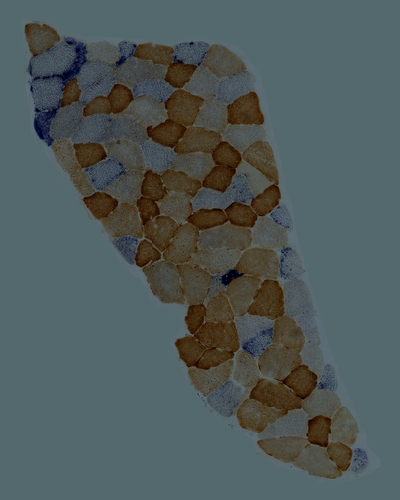
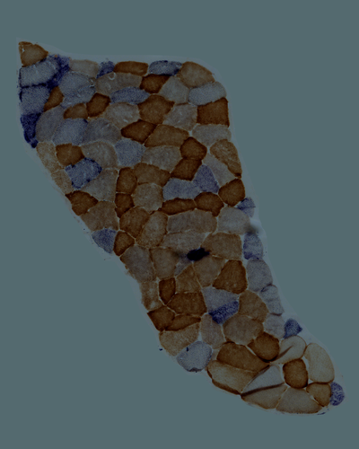
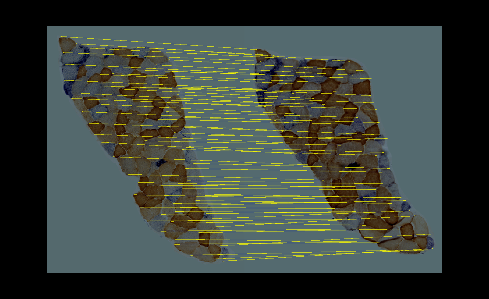
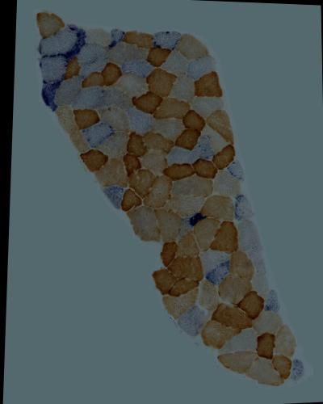
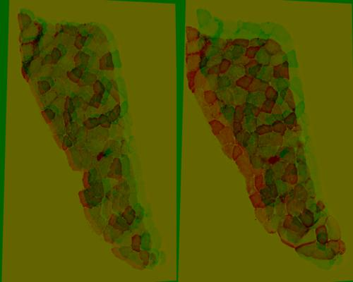

## Samples Description 
#### Reference image

A cropped section from P2 S005.jpg. The image was brightened, contrast-increased and resized to 400 X 500.

#### Target image

A cropped section from P2 S006.jpg. The image was brightened, contrast-increased and resized to 400 X 500.

## Method
[napari_annotate](../napari_annotate.py) was run to annotate and match features of the images manually. 70 pairs of matched keypoints was transformed by [cv2.findHomography](https://docs.opencv.org/4.5.2/d9/d0c/group__calib3d.html#ga4abc2ece9fab9398f2e560d53c8c9780) for warping. 
#### Features & Matches

#### Alignment

#### Quality test

Euclidean distance and correlation coefficient between aligned result and source images were calculated as follows:

|     Source      | Euclidean Distance | Correlation Coefficient |
| ------------ | --- | --- |
| Reference Image | 15295.473905701647 |   0.6392617044642342    |
|  Target Image   | 19742.498702038705 |   0.5107435608633077    |

## Conclusion
Comparing to the best method (method 7) in [colour_brighted](colour_brightened.md), result from manual annotation has a larger number of Euclidean distance and a lower correlation to the target image.
The result also performed worse than method 5 in [colour_brighted](colour_brightened.md), which had a less matches number (50 of good matches) for warping.