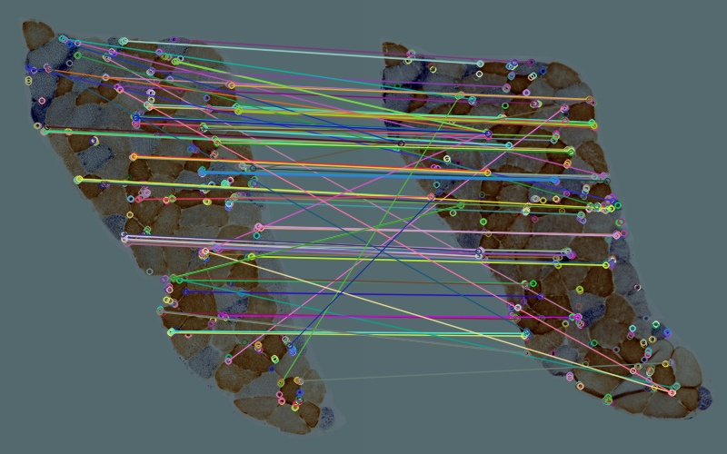
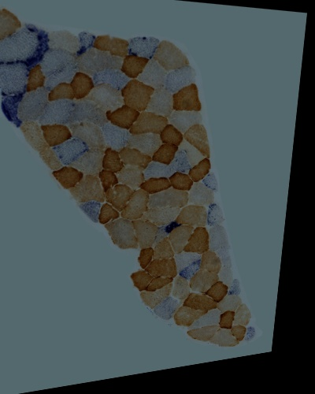
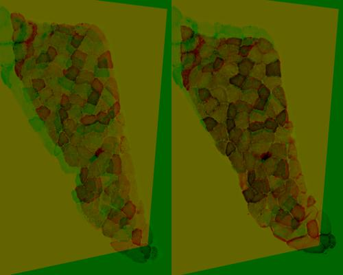
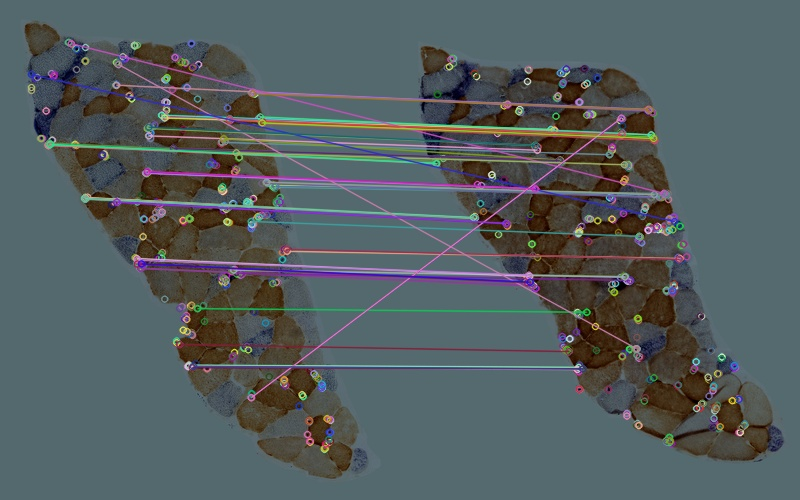
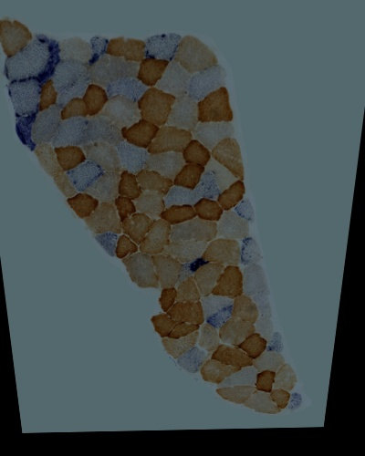
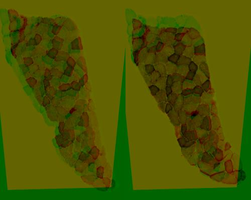

## Samples Description 
#### Reference image

A cropped section from P2 S005.jpg. The image was brightened, contrast-increased and resized to 400 X 500.

#### Target image

A cropped section from P2 S006.jpg. The image was brightened, contrast-increased and resized to 400 X 500.

## Method
[napari_annotate](../napari_annotate.py) was run to annotate and match features of the images manually. 70 pairs of matched keypoints was transformed by [cv2.findHomography](https://docs.opencv.org/4.5.2/d9/d0c/group__calib3d.html#ga4abc2ece9fab9398f2e560d53c8c9780) for warping. 
#### Features & Matches

#### Alignment

#### Quality test

Euclidean distance and correlation coefficient between aligned result and source images were calculated as follows:

|     Source      | Euclidean Distance | Correlation Coefficient |
| ------------ | --- | --- |
| Reference Image | 15295.473905701647 |   0.6392617044642342    |
|  Target Image   | 19742.498702038705 |   0.5107435608633077    |

### Method 2
[align_orb.py](../align_orb.py) was run to align the two samples. Features of the images were detected by ORB detector. 
Features were matched by cv2.DESCRIPTOR_MATCHER_BRUTEFORCE_HAMMING and top 30% matches were selected for warping.
#### Features & Matches

|  Matching Data  |   |
| -----------------------------------  | --- |
| Total features detected in Ref Image | 494 |
| Total features detected in Tar Image | 500 |
|          Good Match Percent          | 0.3 |
|     Number of good matches found     | 148 |

#### Alignment

#### Quality Test

Euclidean distance and correlation coefficient between aligned result and source images were calculated as follows:

|     Source      | Euclidean Distance | Correlation Coefficient |
| -------- | --- | --- |
| Reference Image | 17161.954842033585 |   0.5339714769539863    |
|  Target Image   | 16174.005193519632 |   0.6556330311677803    |

### Method 3 
[align_orb.py](../align_orb.py) was run to align the two samples. Features of the images were detected by ORB detector. 
Features were matched by cv2.DESCRIPTOR_MATCHER_BRUTEFORCE_HAMMING and top 30% matches were selected for warping.
#### Features & Matches

|  Matching Data  |   |
| -----------------------------------  | --- |
| Total features detected in Ref Image | 494  |
| Total features detected in Tar Image | 500  |
|          Good Match Percent          | 0.15 |
|     Number of good matches found     |  74  |

#### Alignment

#### Quality Test

Euclidean distance and correlation coefficient between aligned result and source images were calculated as follows:

|     Source      | Euclidean Distance | Correlation Coefficient |
| -------- | --- | --- |
| Reference Image | 16723.058183239093 |   0.5622422906490607    |
|  Target Image   | 15819.936093423386 |   0.6762548952500411    |

## Conclusion
Comparing to method 2, which was run with the best parameter proved by [colour_brightened](colour_brightened.md), result from method 1 has a larger number of Euclidean distance and a lower correlation to the target image.
Method 1 also performed worse than method 3, which had a similar matches number for warping.

It is also noteworthy that although 30% of good matches has been proved the best parameter for aligning S007 and S008 before, it is not the best method in this case of aligning S005 and S006.