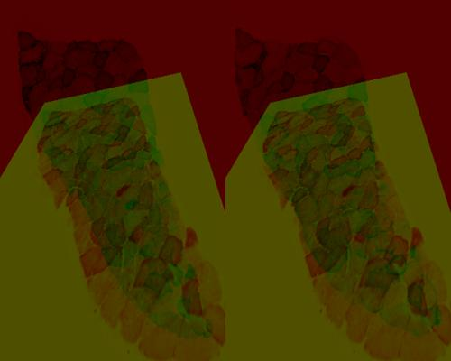
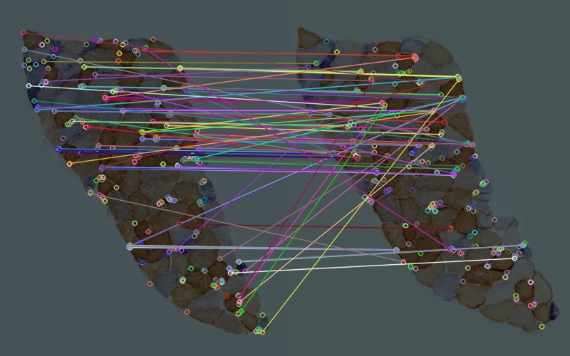

## Samples Description 
#### Reference image

A cropped section from P2 S007.jpg. The image was resized to 400 X 500.

#### Target image

A cropped section from P2 S008.jpg. The image was resized to 400 X 500.

## Methods
In method 1 to 3, images were detected by [SIFT](https://docs.opencv.org/master/da/df5/tutorial_py_sift_intro.html) detector. Matches were sorted by different euclidean distance for warping. In method 4 to 7, images were detected by [ORB](https://docs.opencv.org/master/d1/d89/tutorial_py_orb.html) detector. Different percentage of good matches were selected for warping. 
### Method 1
[align_sift.py](../align_sift.py) was run to align the two samples. Features of the images were detected by SIFT detector and matched by [cv2.BFMatcher.knnMatch](https://docs.opencv.org/master/d3/da1/classcv_1_1BFMatcher.html). Matches with distance smaller than *0.80* were used for warping.
#### Features & Matches

|  Matching Data  |   |
| -----------------------------------  | --- |
| Total features detected in Ref Image | 173  |
| Total features detected in Tar Image | 160  |
|          Euclidean Distance          | <0.8 |
|     Number of good matches found     |  21  |
#### Alignment

### Method 2
[align_sift.py](../align_sift.py) was run to align the two samples. Features of the images were detected by SIFT detector and matched by cv2.BFMatcher.knnMatch. Matches with distance smaller than *0.75* were used for warping.
#### Features & Matches

|  Matching Data  |   |
| -----------------------------------  | --- |
| Total features detected in Ref Image |  173  |
| Total features detected in Tar Image |  160  |
|          Euclidean Distance          | <0.75 |
|     Number of good matches found     |  12   |
#### Alignment

#### Quality test

### Method 3
[align_sift.py](../align_sift.py) was run to align the two samples. Features of the images were detected by SIFT detector and matched by cv2.BFMatcher.knnMatch. Matches with distance smaller than *0.70* were used for warping.
#### Features & Matches

|  Matching Data  |   |
| -----------------------------------  | --- |
| Total features detected in Ref Image | 173  |
| Total features detected in Tar Image | 160  |
|          Euclidean Distance          | <0.7 |
|     Number of good matches found     |  9   |

#### Alignment

### Method 4
[align_orb.py](../align_orb.py) was run to align the two samples. Features of the images were detected by ORB detector. 
Features were matched by [cv2.DESCRIPTOR_MATCHER_BRUTEFORCE_HAMMING](https://docs.opencv.org/3.4/db/d39/classcv_1_1DescriptorMatcher.html) and top 25% matches were selected for warping.
#### Features & Matches

|  Matching Data  |   |
| -----------------------------------  | --- |
| Total features detected in Ref Image | 424  |
| Total features detected in Tar Image | 405  |
|          Good Match Percent          | 0.25 |
|     Number of good matches found     |  106  |
#### Alignment

#### Quality test

Euclidean distance and correlation coefficient between aligned result and source images were calculated as follows:

|     Source      | Euclidean Distance | Correlation Coefficient |
| ------------ | --- | --- |
| Reference Image | 12209.64823408111  |   0.5988294216837112    |
|  Target Image   | 9966.248642292645  |   0.7346319998577098    |

### Method 5
[align_orb.py](../align_orb.py) was run to align the two samples. Features of the images were detected by [ORB](https://docs.opencv.org/master/d1/d89/tutorial_py_orb.html) detector. 
Features were matched by cv2.DESCRIPTOR_MATCHER_BRUTEFORCE_HAMMING and top 15% matches were selected for warping.
#### Features & Matches

|  Matching Data  |   |
| -----------------------------------  | --- |
| Total features detected in Ref Image | 424  |
| Total features detected in Tar Image | 405  |
|          Good Match Percent          | 0.15 |
|     Number of good matches found     |  63  |
#### Alignment

#### Quality test

Euclidean distance and correlation coefficient between aligned result and source images were calculated as follows:

|     Source      | Euclidean Distance | Correlation Coefficient |
| ------------ | --- | --- |
| Reference Image | 11904.834816157678 |   0.6073649842399925    |
|  Target Image   | 9632.593835514917  |   0.7424880154313189   |

### Method 6
[align_orb.py](../align_orb.py) was run to align the two samples. Features of the images were detected by [ORB](https://docs.opencv.org/master/d1/d89/tutorial_py_orb.html) detector. 
Features were matched by cv2.DESCRIPTOR_MATCHER_BRUTEFORCE_HAMMING and top 5% matches were selected for warping.
#### Features & Matches

|  Matching Data  |   |
| -----------------------------------  | --- |
| Total features detected in Ref Image | 424  |
| Total features detected in Tar Image | 405  |
|          Good Match Percent          | 0.05 |
|     Number of good matches found     |  21  |
#### Alignment

#### Quality test

Euclidean distance and correlation coefficient between aligned result and source images were calculated as follows:

|     Source      | Euclidean Distance | Correlation Coefficient |
| ------------ | --- | --- |
| Reference Image | 12404.757796910022 |   0.5866783979120821    |
|  Target Image   | 10209.023410689193 |   0.7221771907284446    |

### Method 7
[align_orb.py](../align_orb.py) was run to align the two samples. Features of the images were detected by [ORB](https://docs.opencv.org/master/d1/d89/tutorial_py_orb.html) detector. 
Features were matched by cv2.DESCRIPTOR_MATCHER_BRUTEFORCE_HAMMING and top 10% matches were selected for warping.
#### Features & Matches

|  Matching Data  |   |
| -----------------------------------  | --- |
| Total features detected in Ref Image | 424  |
| Total features detected in Tar Image | 405  |
|          Good Match Percent          | 0.1 |
|     Number of good matches found     |  21  |
#### Alignment

#### Quality test

Euclidean distance and correlation coefficient between aligned result and source images were calculated as follows:

|     Source      | Euclidean Distance | Correlation Coefficient |
| ------------ | --- | --- |
| Reference Image | 11905.634548397662 |   0.5980571389951187    |
|  Target Image   | 9578.546706050976  |    0.737844820880378    |

## Conclusion
In conclusion, alignments launched by ORB method performed better than those by SIFT method. 
For the quality testing metrics, result with 10% good matches has a smaller Euclidean distance than other ORB alignments, 
while result with 15% good matches shows a higher correlation.
