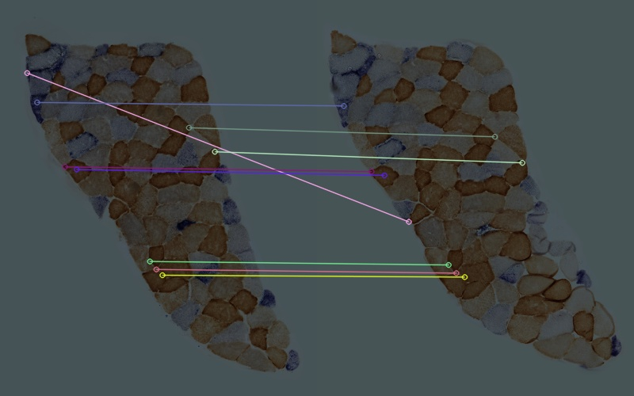

## Samples Description 
#### Reference image

A cropped section from P2 S007.jpg. The image was resized to 400 X 500.

#### Target image

A cropped section from P2 S008.jpg. The image was resized to 400 X 500.

## Methods
### Method 1
[align_sift.py](../align_sift.py) was run to align the two samples. Features of the images were detected by [SIFT](https://docs.opencv.org/master/da/df5/tutorial_py_sift_intro.html) detector and matched by [cv2.BFMatcher.knnMatch](https://docs.opencv.org/master/d3/da1/classcv_1_1BFMatcher.html). Matches with distance smaller than *0.80* were used for warping.
#### Features & Matches

#### Alignment

### Method 2
[align_sift.py](../align_sift.py) was run to align the two samples. Features of the images were detected by [SIFT](https://docs.opencv.org/master/da/df5/tutorial_py_sift_intro.html) detector and matched by [cv2.BFMatcher.knnMatch](https://docs.opencv.org/master/d3/da1/classcv_1_1BFMatcher.html). Matches with distance smaller than *0.75* were used for warping.
#### Features & Matches

#### Alignment

#### Quality test

### Method 3
[align_sift.py](../align_sift.py) was run to align the two samples. Features of the images were detected by [SIFT](https://docs.opencv.org/master/da/df5/tutorial_py_sift_intro.html) detector and matched by [cv2.BFMatcher.knnMatch](https://docs.opencv.org/master/d3/da1/classcv_1_1BFMatcher.html). Matches with distance smaller than *0.70* were used for warping.
#### Features & Matches

#### Alignment

### Method 4
[align_orb.py](../align_orb.py) was run to align the two samples. Features of the images were detected by [ORB](https://docs.opencv.org/master/d1/d89/tutorial_py_orb.html) detector. Features were matched by [cv2.DESCRIPTOR_MATCHER_BRUTEFORCE_HAMMING](https://docs.opencv.org/3.4/db/d39/classcv_1_1DescriptorMatcher.html) and top 15% matches were selected for warping.
#### Features & Matches

#### Alignment

#### Quality test
